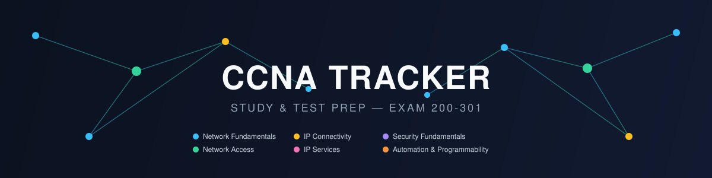

# CCNA Tracker — Study & Test Prep Repo


Companion to [`cisco-track`](https://github.com/Cop1ouss/cisco-track) — that repo
holds the Jeremy's IT Lab notes and Cisco Networking Academy coursework. This one
is the hands-on, gamified, test-prep side: labs, drills, flashcards, and boss
battles, built around the official CCNA 200-301 v1.1 blueprint (six domains,
in effect through Feb 2, 2027).

## Structure

| Path | What lives here |
|---|---|
| `boss-battles/` | One file per exam domain — objective checklist, XP/status tracking, missed-question log (styled after the `secplus-tracker` Agent Dajoni system) |
| `ultimate-guide/` | One synthesized study file per domain, built from cross-referencing `cisco-track`'s course notes against each boss battle's objective checklist — merged explanations, real IOS command examples, and honestly-flagged gaps where no note covers a blueprint objective |
| `practice-questions/` | Original practice questions with hidden-answer explanations, organized by domain and weighted toward higher-blueprint-weight domains |
| `mock-exams/` | Full-length mocks at the real domain weight distribution — questions and answer key kept in separate files so a mock can be taken cold |
| `flashcards/ccna-core-facts.csv` | Anki-importable deck — ADs, port numbers, HTTP codes, STP/HSRP facts |
| `scripts/subnet_drill.py` | Timed CLI subnetting quiz generator (stdlib only) |
| `scripts/coverage.py` | Readiness dashboard — reads Status/XP from the boss battles and prints per-domain and blueprint-weighted overall readiness |
| `scripts/sync_anki.py` | Pushes new/updated flashcards into a running Anki instance via AnkiConnect, instead of manual CSV re-import |
| `packet-tracer-labs/` | Self-imposed Packet Tracer challenge log |
| `gns3-topologies/` | Real(er) routing/switching topologies tied into the home lab |
| `tryhackme-log/` | Networking-focused CTF rooms completed |
| `STUDY-PLAN.md` | Suggested weekly rhythm, mapped to the Todoist recurring tasks |

## Quick start

```bash
# Run a subnetting drill
python3 scripts/subnet_drill.py -n 15

# Check overall exam readiness (per-domain + blueprint-weighted total)
python3 scripts/coverage.py

# Push new/updated flashcards into a running Anki instance (requires the
# AnkiConnect add-on: https://ankiweb.net/shared/info/2055492159)
python3 scripts/sync_anki.py --dry-run   # preview
python3 scripts/sync_anki.py             # apply

# Or import flashcards/ccna-core-facts.csv into Anki manually as a new deck
# File > Import in Anki, comma-separated, first line as header
```

## Exam blueprint (v1.1, live through Feb 2, 2027)

| Domain | Weight |
|---|---|
| Network Fundamentals | 20% |
| Network Access | 20% |
| IP Connectivity | 25% |
| IP Services | 10% |
| Security Fundamentals | 15% |
| Automation & Programmability | 10% |

IP Connectivity is the single biggest domain — weight your study time there.
v1.1 added generative/predictive AI & ML topics and swapped Puppet/Chef
references for Ansible/Terraform in the automation domain.

## Resources

**Video** — [Jeremy's IT Lab](https://www.youtube.com/@JeremysITLab) (primary), [NetworkChuck](https://www.youtube.com/@NetworkChuck) (fun supplement)
**Hands-on** — Cisco Packet Tracer, [GNS3](https://www.gns3.com/) / [EVE-NG](https://www.eve-ng.net/)
**Subnetting** — `scripts/subnet_drill.py`, [subnettingpractice.com](https://subnettingpractice.com/)
**CTF-style** — [TryHackMe](https://tryhackme.com/) networking rooms
